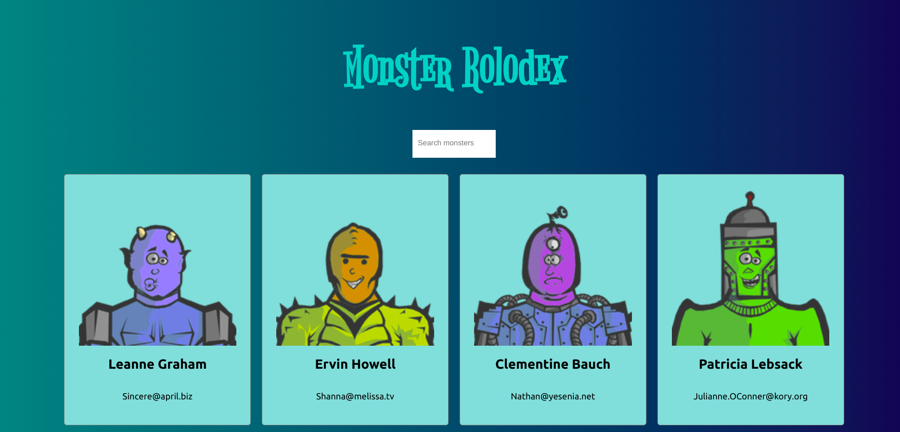
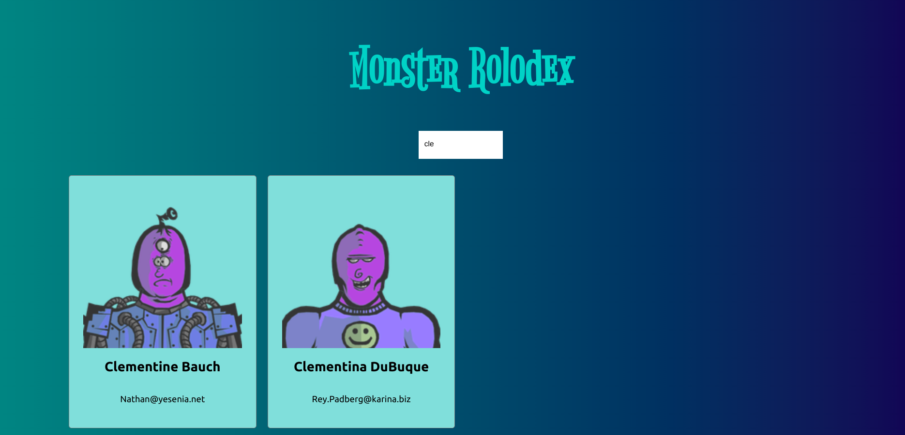

# Monster Rolodex

A tiny project from Andrei's [course](https://www.udemy.com/course/complete-react-developer-zero-to-mastery/) to learn the very basic of React.

## Screenshots

### App preview

### Searching items

That's it! The simplist project in my life, but I learned something :)
